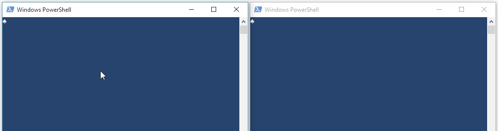

# NamedPipeClient & NamedPipeServer

PowerShell v5 class wrappers around `[System.IO.Pipes.NamedPipeClientStream]` and `[System.IO.Pipes.NamedPipeServerStream]` that implement asynchronous communication using named pipes.

## Usage
